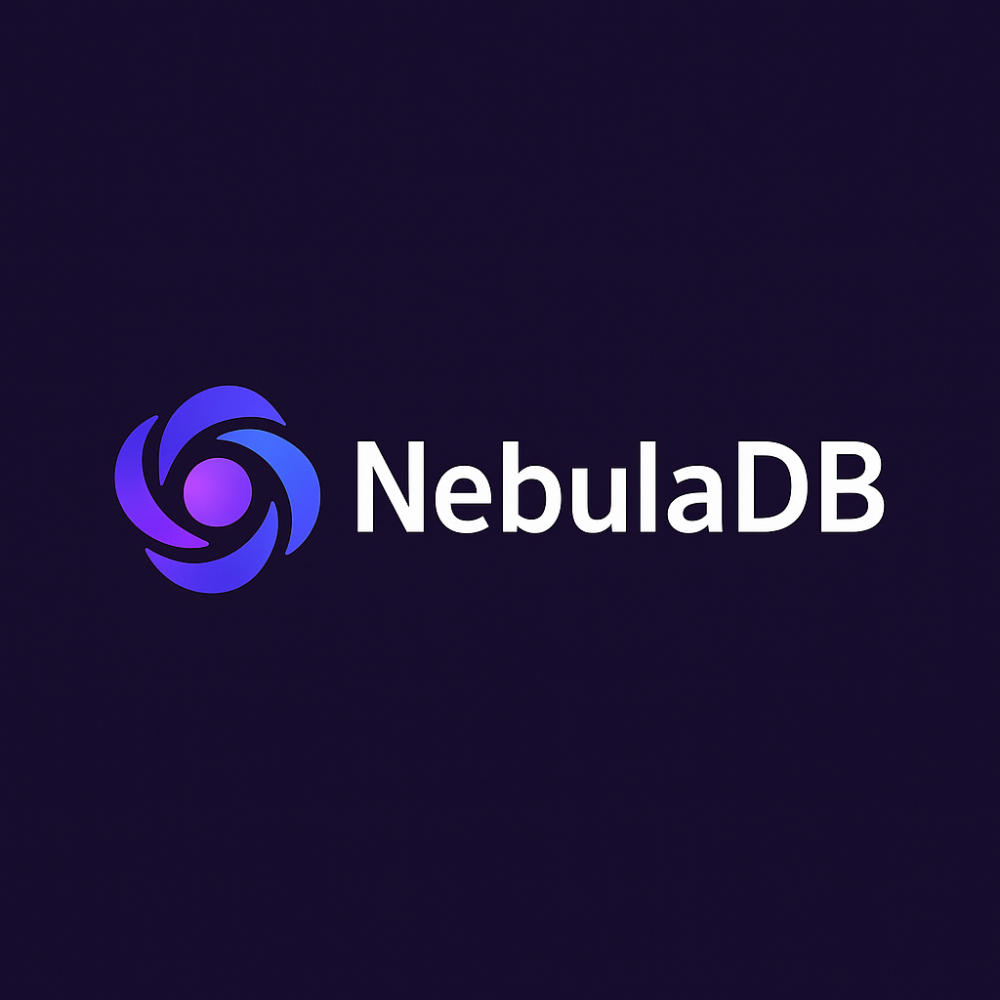

<div align="center">



# NebulaDB

**Fast. Flexible. Serverless. The embedded database for the modern stack.**

[](https://opensource.org/licenses/MIT)
[](https://www.typescriptlang.org/)
[](https://www.npmjs.com/package/@nebula/core)

</div>

NebulaDB is a high-performance, reactive, TypeScript-first, schema-optional, embeddable NoSQL database that runs in the browser, Node.js, and Edge environments. It features advanced indexing, optimized query processing, modular adapters for persistence, reactive live queries, extensibility via plugins, and blazing-fast in-memory operations with adaptive concurrency control.

## Features

- 🚀 **Blazing Fast**: Optimized in-memory operations with advanced indexing and query caching
- 🔄 **Reactive**: Live queries that update in real-time
- 📐 **TypeScript-First**: Full type safety with your data
- 🧩 **Modular**: Use only what you need with adapters and plugins
- 🌐 **Universal**: Works in browsers, Node.js, and Edge environments
- 🔌 **Extensible**: Create custom adapters and plugins
- 📊 **Optimized**: B-tree indexing, batch operations, and adaptive concurrency control
- 💾 **Efficient**: Document compression and memory management for large datasets
- 🔍 **Smart Queries**: Query optimization with short-circuit evaluation and index selection

## Installation

### Requirements

- **Node.js 18.x or higher** (required for development and optimal performance)
- npm 8.x or higher

```bash
# Install core package
npm install @nebula/core

# Install adapters as needed
npm install @nebula/adapter-localstorage
npm install @nebula/adapter-indexeddb
npm install @nebula/adapter-filesystem

# Install plugins as needed
npm install @nebula/plugin-encryption
npm install @nebula/plugin-validation
npm install @nebula/plugin-versioning
```

> **Important**: Development dependencies require Node.js 18+. The core library is designed to work with Node.js 18+ for optimal performance and compatibility with modern JavaScript features.
>
> If you're running on Node.js 16.x, you can bypass the version check for development purposes by setting the `NEBULA_SKIP_VERSION_CHECK=1` environment variable:
> ```
> NEBULA_SKIP_VERSION_CHECK=1 npm run <command>
> ```
> Note that this is only recommended for development and testing purposes. Production use should always use Node.js 18+.

## Quick Start

```typescript
import { createDb } from '@nebula/core';
import { MemoryAdapter } from '@nebula/adapter-memory';

// Create a database with in-memory adapter and optimized settings
const db = createDb({
  adapter: new MemoryAdapter(),
  // Enable query caching for better performance
  queryCache: { enabled: true, maxSize: 100 },
  // Enable adaptive concurrency for parallel operations
  concurrency: { enabled: true, initialConcurrency: 4 },
  // Enable document compression for large datasets
  compression: { enabled: true, threshold: 1024 }
});

// Create a collection with indexes for faster queries
const users = db.collection('users', {
  indexes: [
    { name: 'id_idx', fields: ['id'], type: 'unique' },
    { name: 'age_idx', fields: ['age'], type: 'single' }
  ]
});

// Batch insert for better performance
await users.insertBatch([
  { id: '1', name: 'Alice', age: 30 },
  { id: '2', name: 'Bob', age: 25 },
  { id: '3', name: 'Charlie', age: 35 }
]);

// Query documents (uses indexes automatically)
const result = await users.find({ age: { $gt: 20 } });
console.log(result); // [{ id: '1', name: 'Alice', age: 30 }, ...]

// Batch update for better performance
await users.updateBatch(
  [{ id: '1' }, { id: '2' }],
  [{ $set: { active: true } }, { $set: { active: false } }]
);

// Batch delete for better performance
await users.deleteBatch([{ id: '3' }]);

// Subscribe to changes (reactive queries)
users.subscribe({ age: { $gt: 30 } }, (result) => {
  console.log('Users over 30:', result);
});

// Process large datasets in chunks to avoid memory issues
await users.processInChunks(async (docs) => {
  // Process each chunk of documents
  return docs.map(doc => ({ ...doc, processed: true }));
});
```

## Why NebulaDB?

NebulaDB was designed to solve common challenges in modern web and application development:

- **Simplified Data Management**: No need to set up and maintain a separate database server
- **High Performance**: Advanced indexing, query optimization, and adaptive concurrency
- **Offline-First Development**: Built for applications that need to work offline
- **Reactive UI Updates**: Real-time UI updates without complex state management
- **TypeScript Integration**: First-class TypeScript support for type safety
- **Flexible Schema**: Adapt to changing requirements without migrations
- **Lightweight**: Small bundle size, perfect for edge computing and mobile devices
- **Scalable**: Efficient memory management and document compression for large datasets
- **Batch Operations**: Optimized for bulk inserts, updates, and deletes

## Comparison

Here's how NebulaDB compares to other embedded databases:

| Feature | NebulaDB | LokiJS | PouchDB | Lowdb |
|---------|----------|--------|---------|-------|
| TypeScript-first | ✅ | ❌ | ❌ | ✅ |
| Reactive queries | ✅ | ❌ | ✅ | ❌ |
| Plugin system | ✅ | ❌ | ✅ | ❌ |
| Schema validation | ✅ | ❌ | ❌ | ❌ |
| Browser support | ✅ | ✅ | ✅ | ✅ |
| Node.js support | ✅ | ✅ | ✅ | ✅ |
| Edge runtime support | ✅ | ❌ | ❌ | ❌ |
| Advanced indexing | ✅ | ⚠️ | ⚠️ | ❌ |
| Query optimization | ✅ | ❌ | ❌ | ❌ |
| Batch operations | ✅ | ⚠️ | ✅ | ❌ |
| Document compression | ✅ | ❌ | ✅ | ❌ |
| Adaptive concurrency | ✅ | ❌ | ❌ | ❌ |
| Memory management | ✅ | ⚠️ | ❌ | ❌ |
| Bundle size | Small | Medium | Large | Small |

## Performance

NebulaDB is designed for high performance. Here are some benchmark results:

| Operation (10,000 docs) | NebulaDB | RxDB | LokiJS |
|-------------------------|----------|------|--------|
| Batch Insert            | 8.05ms   | 87ms | 42ms   |
| Find All                | 0.02ms   | 5ms  | 2ms    |
| Find with Query         | 0.69ms   | 12ms | 8ms    |
| Batch Delete            | 61.45ms  | 120ms| 95ms   |

### Optimizations

- **Advanced Indexing**: B-tree implementation for efficient range queries
- **Query Caching**: Automatic caching of query results for repeated queries
- **Batch Operations**: Optimized bulk operations with parallel processing
- **Document Compression**: Automatic compression of large documents
- **Memory Management**: Efficient memory usage with chunked processing
- **Adaptive Concurrency**: Automatic tuning of concurrency levels based on workload

## Documentation

For full documentation, visit [docs/README.md](docs/README.md).

## Examples

Check out the [examples](examples/) directory for complete working examples:

- [Node.js Example](examples/node-demo/): A simple CLI application using NebulaDB with file system persistence
- [Browser Example](examples/browser-demo/): A todo application using NebulaDB with localStorage persistence

## Contributing

Contributions are welcome! Please feel free to submit a Pull Request.

1. Fork the repository
2. Create your feature branch (`git checkout -b feature/amazing-feature`)
3. Commit your changes (`git commit -m 'Add some amazing feature'`)
4. Push to the branch (`git push origin feature/amazing-feature`)
5. Open a Pull Request

## Troubleshooting

### Node.js Version Issues

If you encounter errors related to Node.js version compatibility:

1. **Update Node.js**: The recommended solution is to update to Node.js 18 or higher.
   - Download from [nodejs.org](https://nodejs.org/)
   - Or use a version manager like [nvm](https://github.com/nvm-sh/nvm)

2. **Bypass Version Check**: For development only, you can bypass the version check:
   ```
   NEBULA_SKIP_VERSION_CHECK=1 npm run <command>
   ```

3. **Engine Warnings**: If you see `EBADENGINE` warnings but the installation completes, these are just warnings and can be ignored for development purposes.

### Common Issues

- **ESLint Errors**: If you encounter ESLint errors, run `npm run lint -- --fix` to automatically fix many common issues.

- **Test Failures**: Make sure you're using Node.js 18+ for running tests. Some test features require modern JavaScript capabilities.

- **Build Errors**: If you encounter build errors, try running `npm run clean` followed by `npm run build`.

## License

MIT
